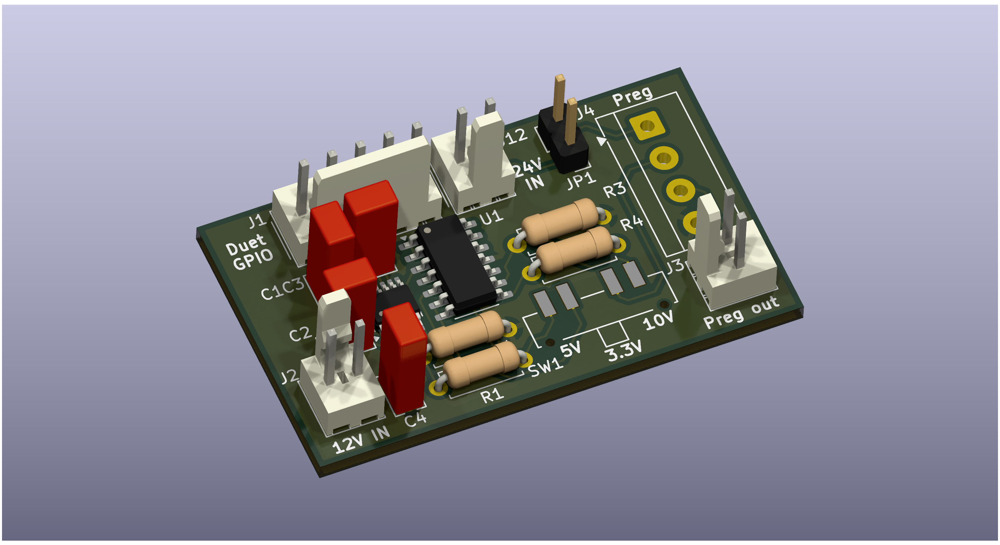
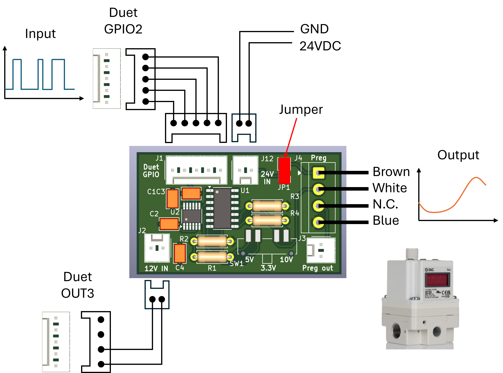

# 🔌 Duet PWM-Analog Peripheral PCB

A compact, open-source PCB designed to interface with **Duet motherboards**, enabling reliable control of external peripheral devices requiring continuous analog control signal. This repository contains all necessary design and manufacturing files to reproduce, modify, and integrate the board into your own projects.

---

## 📌 Overview

This project provides a hardware solution for expanding the capabilities of Duet-based systems by offering:

* Clean and modular peripheral interfacing
* Reliable signal routing and power distribution
* Easy integration with existing Duet ecosystems
* Direct interface with Duet's native GPIOs to convert PWM signals into continuous analog signals 
* Support for PWM conversion to analog output in the range of 0-3.3V, 0-5V, and 0-10V, configurable via a built-in switch 

The design is fully open-source and built using **KiCad 9.0**, making it accessible for customization and further development.

---

## 📂 Repository Structure

```
├── /kicad/              # KiCad project files (.kicad_pro, .kicad_sch, .kicad_pcb)
├── /gerbers/            # Manufacturing Gerber files and ZIP file for manufacturing
├── /bom/                # Bill of Materials (CSV / ODS / PDF)
└── README.md            # Project documentation
```

---

## 🖼️ Preview



---

## 🚀 Getting Started

### 1. Clone the Repository

```bash
git clone TBD
cd duet-peripheral-pcb
```

### 2. Open in KiCad

* Install **KiCad 9.0** or newer
* Open the project file located in `/kicad/`

### 3. Review the Design

* Inspect schematic (`.kicad_sch`)
* Inspect PCB layout (`.kicad_pcb`)
* Verify design rules and connections

---

## 🏭 Manufacturing

To fabricate the PCB:

1. Navigate to the `/gerbers/` folder
2. Upload either the ZIP file, already with all of the necessary files, or the separate Gerber files and BOM. Follow the instructions of your preferred PCB manufacturer
3. Use the provided BOM (`/bom/`) for component sourcing, also included in the `/gerbers/` folder

### Recommended Checks

* Verify layer stackup compatibility
* Confirm drill sizes and tolerances
* Double-check component footprints

---

## 🧾 Bill of Materials (BOM)

The BOM includes:

* Component references
* Manufacturer part numbers
* Quantities
* Suggested suppliers

You can find it in the `/bom/` directory.

---

## 🔌 Integration with Duet

This board is designed to interface directly with Duet motherboards. Taking as an example the integration the connection with a Duet 3 Mini and an SMC 1050 pressure regulator, the wiring should be performed as shown in the diagram below.



Once connected, the GPIO should be configured manually, or upon printer initialization by adding the following lines to the config.h file of the printer (modify the port number as needed, as well as the port name to match your GPIO).

```
M950 P10 C"io2.out" Q1000
M42 P10 S0
```

The M42 is used to initialize the PWM signal of the GPIO to zero. Further M42 commands can be sent during operation to adjust on-the-fly the duty cycle of the PWM signal, and the resulting analog voltage from the board.

---

## 📜 License

This project is licensed under the **GPL-3.0 license**.

---

## 🙌 Acknowledgements

* Duet3D community
* KiCad development team

---

## 📬 Contact / Issues

For questions or collaboration:

* GitHub Issues
* E-mail: [ruben.martinrodriguez@unibas.ch](mailto:ruben.martinrodriguez@unibas.ch)

